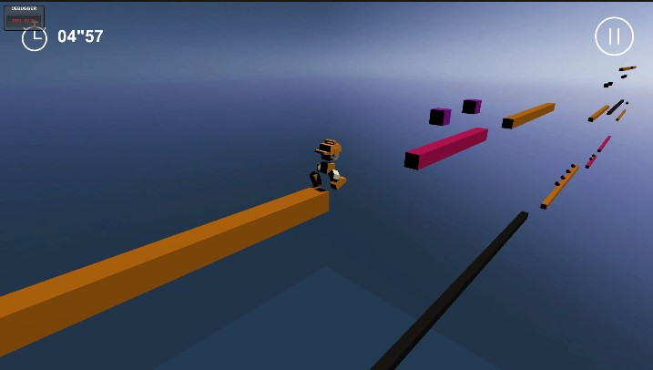
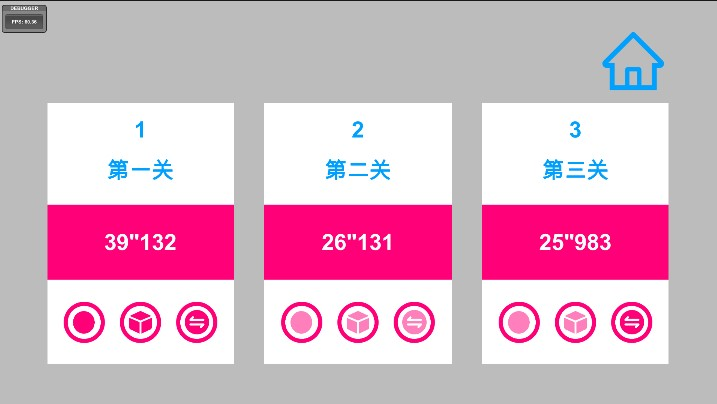
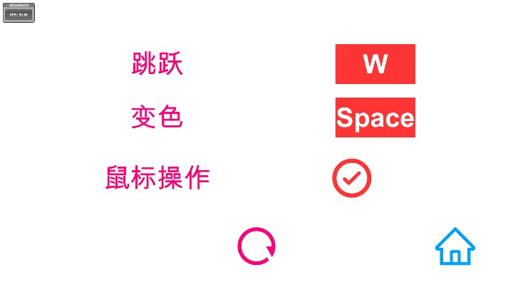

# Chameleon

三天快速开发“急速变色龙”小游戏，使用UnityGameFramework框架。

面试时给的题目，在4399可以找到这个游戏原型。面试方提供模型和动作

## 系统
### 核心玩法
  
变色小人在地图狂奔.可以切换自身颜色和跳跃。
小人只能落在对应颜色的地面上，接触不同颜色的地面或掉下虚空则死亡。
到达终点即通过本关解锁下一关。  
  
在跑酷过程中收集收集品，收集完一个系列的收集品就能解锁本关成就栏对应成就。  
每一关都有计时，完成关卡会将用时记录在每一关的成就栏。

### 关卡制作
可以在场景中搭建关卡，并用关卡序列化工具将关卡信息保存到Assets中。
计划加入关卡热更。

### 设置
  
用户可以设置按键并保存到本地。